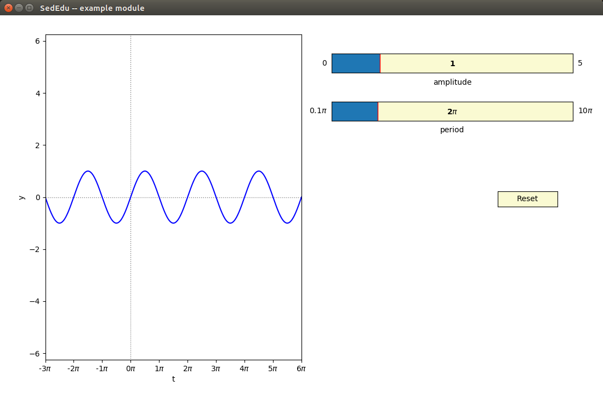

# Example Module for SedEdu

This module exists to give module developers a sense of what is possible, and a potential workflow for designing their modules. 
This `README.md` is __not__ meant to be a template for a module readme; you can find a template README in the `template-module` INSERT LINK HERE!!

<!-- In fact, the companion repository `template-module` is a great place to look for additional examples of a blank `about.json` and `README.md` file. -->

## Folder organization


## The Module

The main module code resides in `src/example-module.py`. 
This is the executable code that will launch your module when called from SedEdu.
A complete walk-through of this file is below, but the basic workflow is to:
1. set initial parameters
1. define functions to run the module and update the plots (i.e., the backend)
1. run the model once
1. set up the figure
1. set up and connect the interactive widgets

Please note that what follows is __not__ meant to be an exhaustive description of what you can do with a module.
There is no reason that your module should be limited to one main figure, or only slider widgets, or even using `matplotlib` as the main back end.
You are encouraged to be way more creative in designing your module!

This is also not supposed to be a tutorial on Python, matplotlib, etc.; please refer to documentation and tutorials in those tools for more information.

The module we will develop here is not really a model, but just a simple evaluation of the sine function over a predefined interval.
We'll introduce some sliders to manipulate the amplitude and period of the sine and link those to updating the  when they are moved.
Finally, we'll add a button to reset the module to its initial condition.
The module GUI is below.




### Setting initial parameters
First we import the packages/libraries needed:

```
import numpy as np
import matplotlib.pyplot as plt
import matplotlib.widgets as widget
import utils
```

`matplotlib`'s `pyplot` and `widgets` will provide the bulk of the interface elements we use in this simple module.
You should do all your package/module imports at the start of the script here. 
SedEdu modules already depends on `scipy` (and `numpy`), `matplotlib`, `pygame`, and `shapely`, as well as all the standard packages; feel free to import and use anything in these packages in your module.
If you need another package, you will need to make a strong case for including it in SedEdu as a requirement; open an issue on [sededu/issues](https://github.com/amoodie/sededu/issues) to discuss this with other developers/maintainers.

Next, we declare the parameter set used in our model.
This could include anything from model coefficients to plotting vectors, and should include the limits you will use on any sliders that manipulate parts of the model.

```
pi = np.pi
t = np.linspace(-3*pi, 6*pi, 1000)

ampInit = 1
amp = ampInit
ampMax = 5
ampMin = 0

perInit = 1
per = perInit
perMax = 3
perMin = 0
```

In this case, we set up the "x" coordinates of our plot as the period of the sine function `t`. 
The next two blocks initiate the amplitude and period variables (`amp` and `per`) and the bounds on the sliders (`ampMin`, `perMax`, etc.) that we'll use later when we make the sliders.


### Defining functions
Next we define some functions, in this module we'll only define two, since out model is very simple.
In most any module you design the minimum requirement would be an `update` function that is run on some `event`.
This `event` could be (as in our case) a change in slider position, or a button press, or a mouse click, or many other possible event triggers. 

Our `update` function will simply grab the current value of the sliders (i.e., get the amplitude and period of the sine function), recalculate the sine function, and update the plot to reflect the new sine function.

```
def update(event):
    # read values from the sliders/statics
    theamp = slide_amp.val # using "the" here keeps main namespace clean
    theper = slide_per.val

    # compute new y values
    they = theamp * np.sin( theper * t )

    # update the plot
    sin_line.set_ydata(they)

    # replace in main namespace
    amp = theamp
    per = theper
    y = they

    # redraw the canvas
    fig.canvas.draw_idle()
```

We have not created the sliders yet, so this may be a little confusing, but we are going to create two sliders called `slide_amp` and `slide_per` that each have an attribute `val` that contains the value of the slider object. 
We use these values to compute the new y coordinates. 
Inside the function, we use variables prefixed with "the" to ensure we are using the new values and not muddying the namespace with that outside the function.
This shouldn't be strictly necessary, but if you have some weird bugs in updating from sliders it might be fixed by prefixing with "the".


### Run the model once first

### Setting up a main figure


### Setting up and connecting widgets


## Integrating into SedEdu
The `about.json` file
